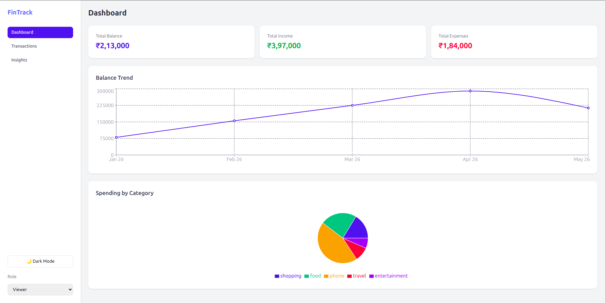

# FinTrack — Finance Dashboard

Built as a screening assessment for the Zorvyn FinTech frontend internship role.

## Live Demo
[https://financial-dashboard-lyart-kappa.vercel.app/](https://financial-dashboard-lyart-kappa.vercel.app/)

## Prerequisites
- Node.js 16+
- npm

## Setup
git clone https://github.com/AdityaM-IITH/financial-dashboard
cd financial-dashboard
npm install
npm run dev

## Features

### Dashboard
- Summary cards — Total Balance, Income, Expenses
- Cumulative balance trend (line chart)
- Spending breakdown by category (pie chart)

### Transactions
- Full transaction list with date, name, category, type, amount
- Search by name or category
- Filter by type (income/expense)
- Sort by date or amount
- Export to CSV

### Role-Based UI
- Switch between Viewer and Admin via dropdown
- Viewer: read-only access
- Admin: add and delete transactions

### Insights
- Highest spending category
- Most expensive single transaction
- Savings rate
- Best income month
- Month-over-month expense comparison
- Monthly income vs expenses bar chart

### Additional
- Dark mode (persisted)
- Local storage persistence
- Responsive design (mobile + desktop)
- Empty state handling

## Approach

State is managed via React Context API — transactions, role, and theme are global while search, filters, and form state are local to their components. This keeps global state minimal and components self-contained.

Chart data is derived on every render using array methods — no separate data store needed. The balance trend uses a cumulative running total for accurate financial representation.

Role-based UI is simulated entirely on the frontend — Admin enables add/delete functionality while Viewer sees read-only data.

## Known Limitations
- Transaction table requires horizontal scroll on very small screens
- Role resets to Viewer on page refresh
- Mock data only — no backend integration

## License
MIT
